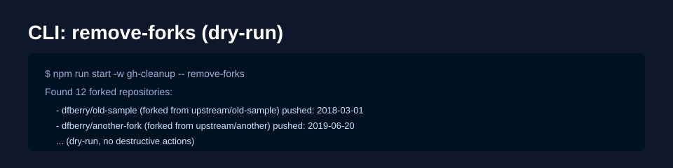
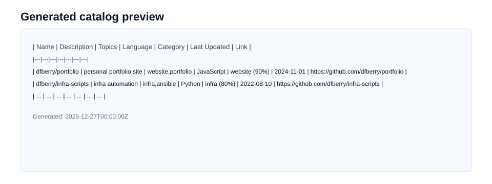

# Clean Up Your GitHub Repos — End-of-Year Side Project

A short guide to using the repository-cleanup tooling in this repo to audit and clean personal GitHub accounts. This is a practical, quick project you can run on your account to remove forks, archive stale repos, delete empty repos, and produce a catalog of the projects you want to keep.

Intro: what "cleanup" can mean

Cleanup goes beyond removing unused repositories. When tidying a personal or org GitHub account you may also:

- Reclaim unused cloud resources referenced by projects (e.g., old deployments, test clusters, or storage buckets).
- Remove or archive unused repositories that are forks, abandoned, or no longer relevant.
- Find and fix failing or stale GitHub Actions workflows (update action versions or workflow syntax) or remove workflows that are no longer useful.
- Update CI matrices and runtimes (programming language versions, OS matrix entries) to reduce CI cost and avoid testing very-old combinations.
- Bump pinned GitHub Action versions and dependencies to address deprecations and security fixes.

This repo focuses on repository-level cleanup (archive/delete/catalog), but the same audit run can help you discover candidates for cloud-resource reclamation and CI/workflow maintenance.

Why I built this
- End-of-year spring cleaning for personal GitHub accounts.
- Make it easy to find and archive old or unused projects, and to surface interesting projects for a portfolio site.

Prerequisites
- Node.js >= 22
- A GitHub token in `GH_TOKEN` (classic PAT with repo/delete_repo scopes for destructive ops)

Quick install

```bash
# clone the repo
git clone <repo-url>
cd <repo>
# install workspace deps (if any)
npm install
# build packages
npm run build
```

One-line run examples

- Remove forks (dry-run):

```bash
npm run start -w gh-cleanup -- remove-forks
```

- Archive stale repos (dry-run):

```bash
npm run start -w gh-cleanup -- archive-stale-repos
```

- Delete empty repos (dry-run):

```bash
npm run start -w gh-cleanup -- delete-empty-repos
```

- Categorize repos (fetch languages + README, output Markdown):

```bash
npm run start -w gh-cleanup -- categorize-repos --fetch --output=md --out=generated/catalog.md
```

- Summary (write `generated/summary.md`):

```bash
npm run start -w gh-cleanup -- summary --summary-out=generated/summary.md
```

What the tooling does (short)
- `remove-forks`: Lists forked repos you own — can optionally delete them.
- `archive-stale-repos`: Finds repos with no recent activity and optionally archives them.
- `delete-empty-repos`: Detects repos that appear empty (size === 0, no commits/PRs) and can delete them.
- `categorize-repos`: Heuristically assigns categories using language, topics and README content.
- `summary`: Produces a short report and an optional Markdown table for site inclusion.

Code snippets

1) Example: programmatically categorizing repositories (excerpt from `packages/gh-cleanup/src/lib/repo-utils.ts`):

```ts
// fetch languages + README via shared helpers
const languages = await gh.repos.getRepoLanguages(client, owner, name);
const readme = await gh.repos.getRepoReadme(client, owner, name);
const { category, confidence } = await scoreCategory(repo, languages, readme, repo.topics);
```

2) Example: writing Markdown output (excerpt from `packages/gh-cleanup/src/lib/report.ts`):

```ts
const md = toMarkdownTable(items, { title: 'Repository Catalog', includeFrontmatter: true });
await emitOutput(addGeneratedTimestamp(md, 'Repo Catalog'), outPath);
```

Using the LLM to generate repository descriptions and topics
----------------------------------------------------------

This project can automatically generate short/long descriptions and suggested topics
for repositories using the bundled LLM helpers. The describe step is implemented in
`gh-cleanup` and uses the `llm-completion` package for calling the model and
sanitizing the response. The output includes both the AI-generated result and
applied flags showing what (if anything) was patched on the repository.

Example: generate descriptions (dry-run)

```bash
# produce AI suggestions for repositories listed in generated/active.json
npm run start -w gh-cleanup -- describe-repos --repos=generated/active.json --out=generated/descriptions.json
```

Example: apply suggested descriptions and topics (use with caution)

```bash
# forward --apply to actually patch repo descriptions/topics
npm run start -w gh-cleanup -- describe-repos --repos=generated/active.json --out=generated/descriptions.json --apply --openai-key=$OPENAI_API_KEY
```

Sample output item (JSON)

```json
{
	"repo": "owner/repo",
	"ai": {
		"short": "Lightweight CLI for X",
		"long": "A small tool that helps automate X by doing Y and Z...",
		"topics": ["cli","automation","tools"],
		"links": ["https://example.com/docs"]
	},
	"applied": { "description": false, "topics": false }
}
```

Embedding AI descriptions in your blog post
-----------------------------------------

You can include the generated description and topics directly in a post by
consuming the generated JSON and inlining the fields. For example, to include
the short description and topics for a repo in Markdown:

```md
### owner/repo

Lightweight CLI for X — A small tool that helps automate X by doing Y and Z.

Topics: `cli`, `automation`, `tools`

[Project docs](https://example.com/docs)
```

If you prefer automation, parse `generated/descriptions.json` and render the
content into your static site generator or a README snippet.


Screenshot placeholders

- Screenshot: CLI run listing forks (replace with your screenshot)



- Screenshot: generated catalog preview (replace with your screenshot)



Notes and safety

- All commands default to dry-run; destructive actions require `--yes` and (by default) a typed `YES` confirmation unless `--force` is used.
- For deletions, use a classic PAT with `delete_repo` permission.

Where to look in the repo
- `packages/github-rest`: REST client helpers and endpoints.
- `packages/gh-cleanup`: CLI commands, categorization rules and reporting helpers.
- `generated/`: sample outputs.
- `.github/package-placement-rules.md` and `plan.md`: developer guidance for moving helpers between packages.

Wrap-up

This tooling is intended to be a lightweight, safe starting point for cleaning up a personal GitHub account. If you use it, consider backing up listings (`--out`) and reviewing dry-run output before performing destructive operations.

If you'd like, I can also add a short tutorial with screenshots or a packaged Docker image to run the tools without installing Node locally.

Convert SVG placeholders to PNG (optional)

If you want PNGs instead of SVGs (for embedding in some publishing tools), you can convert them locally. Example one-liners:

- ImageMagick (convert):

	```bash
	# convert with ImageMagick
	convert docs/images/forks-run.svg docs/images/forks-run.png
	convert docs/images/catalog-preview.svg docs/images/catalog-preview.png
	```

- rsvg-convert (librsvg):

	```bash
	rsvg-convert -o docs/images/forks-run.png docs/images/forks-run.svg
	rsvg-convert -o docs/images/catalog-preview.png docs/images/catalog-preview.svg
	```

I also added a tiny helper script you can run if you have either tool installed:

```bash
./docs/scripts/convert-images.sh
```

Next features to consider

If you plan to extend this project, here are useful next steps that make the tool safer and more broadly usable:

- Docker image / single-binary runner: run the tools without a local Node install.
- GitHub Actions workflow: run periodic audits and publish generated catalogs to a repo/branch.
- Interactive web UI or TUI: browse repos, mark items for archival/deletion before applying changes.
- More heuristics: detect package manifests (package.json, pyproject.toml), license inference, and language fallbacks.
- Batch previews & dry-run improvements: export CSV/JSON plans, side-by-side diffs and a recovery/undo plan.
- Rate-limit aware parallel fetch: speed up metadata fetching while respecting GitHub rate limits.
- Improve tests & CI: add unit tests for new helpers and end-to-end integration tests using a test GitHub org.

If you'd like, I can implement any of these as follow-up PRs — tell me which one you'd like to prioritize.