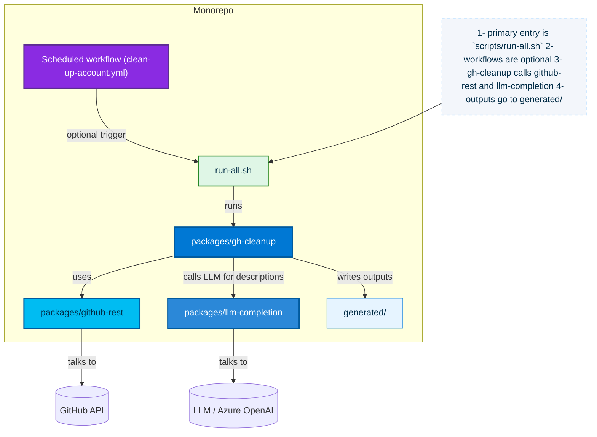

```mermaid
flowchart TB
  %% Nodes
  subgraph Repo[Monorepo]
    direction TB
    GH_CLI["packages/gh-cleanup"]:::gh
    GH_REST["packages/github-rest"]:::rest
    LLM["packages/llm-completion"]:::llm
    GEN["generated/"]:::gen
    SCRIPTS["run-all.sh"]:::script
    WORKFLOWS["Scheduled workflow (clean-up-account.yml)"]:::wf
  end

  GH_CLI -->|uses| GH_REST
  GH_CLI -->|calls LLM for descriptions| LLM
  GH_CLI -->|writes outputs| GEN
  SCRIPTS -->|runs| GH_CLI
  WORKFLOWS -->|optional trigger| SCRIPTS
  GH_REST -->|talks to| GitHubAPI[("GitHub API")]
  LLM -->|talks to| LLMService[("LLM / Azure OpenAI")]

  %% Styling using Azure-like palette
  classDef gh fill:#0078D4,stroke:#005A9E,color:#ffffff,stroke-width:2px;
  classDef rest fill:#00BCF2,stroke:#005A9E,color:#002B45,stroke-width:2px;
  classDef llm fill:#2B88D8,stroke:#005A9E,color:#ffffff,stroke-width:2px;
  classDef gen fill:#E6F4FF,stroke:#0078D4,color:#002B45,stroke-width:1px;
  classDef script fill:#DFF6E6,stroke:#107C10,color:#002B45,stroke-width:1px;
  classDef wf fill:#8A2BE2,stroke:#5C2D91,color:#ffffff,stroke-width:2px;

  %% Accent colors: green and purple used for scripts and workflows
  classDef accentGreen fill:#00B294,stroke:#007A4D,color:#ffffff,stroke-width:1px;
  classDef accentPurple fill:#5C2D91,stroke:#3e1858,color:#ffffff,stroke-width:1px;

  %% External service styling
  class GitHubAPI,LLMService fill:#ffffff,stroke:#9AAFC3,color:#002B45,stroke-width:1px;

  %% Notes
  classDef note fill:#f3f6fb,stroke:#cfe8ff,color:#002b45,stroke-dasharray: 5 5;
  Note["1- primary entry is `scripts/run-all.sh` 2- workflows are optional 3- gh-cleanup calls github-rest and llm-completion 4- outputs go to generated/"]:::note
  Note --> SCRIPTS

```

Save as: /docs/diagrams/architecture.md — drop the code block into Markdown-aware renderers (e.g., GitHub, MkDocs) to visualize.
